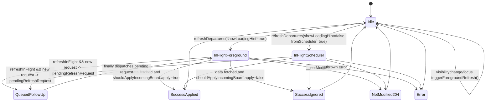
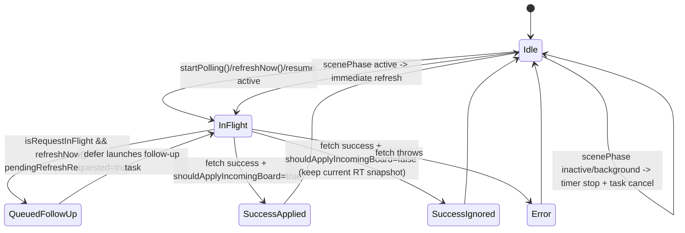

# Freshness Parity Report (Web `v20260228` vs iOS SwiftUI)

Date: 2026-02-26

Status note (2026-02-26):
- `ios/MesDepartsApp/MesDepartsApp.xcodeproj` is the runnable iOS target.
- `ios/MesDepartsIOSApp` is legacy and should not be used for runtime/build validation.

Scope compared:
- Web: `realtime_api/frontend/v20260228.main.js`, `realtime_api/frontend/v20260228.logic.js`, `realtime_api/frontend/v20260228.state.js`
- iOS app: `ios/MesDepartsApp/App/MesDepartsAppApp.swift`, `ios/MesDepartsApp/App/ContentView.swift`
- iOS networking: `ios/MesDepartsCore/Sources/MesDepartsCore/API/StationboardAPI.swift`, `ios/MesDepartsCore/Sources/MesDepartsCore/API/HTTPClient.swift`

This is a code-level state-machine parity audit for stationboard refresh + RT freshness semantics.

## 1) Canonical Web Refresh State Machine

### 1.1 State diagram (web)

### 1.2 Web invariants (enforced in code)

- Single in-flight board request gate:
  - `refreshInFlight` + `pendingRefreshRequest` in `refreshDepartures(...)` (`v20260228.main.js`).
- Foreground-only ownership of loading hint:
  - `showLoadingHint` controls `setEmbedAwareLoadingHint(true/false)`.
  - Scheduler calls always pass `showLoadingHint=false`.
- No stuck loading hint on early returns:
  - In `finally`, `setEmbedAwareLoadingHint(false)` runs before queued/stale early return branches.
  - Verified by `realtime_api/frontend/test/refreshHint.test.js`.
- Stale/superseded response cannot apply:
  - `requestSeq` + station/language snapshot + `isStaleRequest()` guard.
- RT anti-downgrade hold is explicit:
  - `shouldApplyIncomingBoard(...)` in `v20260228.logic.js` keeps last RT snapshot unless forced context change or hard-cap exceeded.
- Cadence is bounded and jittered:
  - `REFRESH_DEPARTURES=15000`, `jitteredDelayMs(...)`, scheduler hidden-tab gating, and focus/visibility catch-up.
- Stationboard fetch bypasses browser cache:
  - `fetch(..., { cache: "no-store" })` in `fetchStationboardRaw(...)`.

## 2) Canonical iOS Refresh State Machine

### 2.1 State diagram (iOS)

### 2.2 iOS invariants (current code)

- Single in-flight gate + coalesced follow-up:
  - `isRequestInFlight` + `pendingRefreshRequested` in `StationboardViewModel.fetchNow()`.
- Superseded request protection:
  - `requestGeneration` + `fetchStopID` checks before apply/error publish.
- Stop switch invalidates old board context:
  - `openStop(...)` increments generation, cancels active fetch, clears board state.
- RT anti-downgrade hold (web-equivalent behavior):
  - `shouldApplyIncomingBoard(incomingHasRTSnapshot:now:)` + `currentBoardHasRTSnapshot` + `lastRTSnapshotAt` hard-cap logic.
- Lifecycle gating:
  - `StationboardView` observes `scenePhase`, starts polling when active and stops in inactive/background.
- Cache bypass intent for stationboard requests:
  - `HTTPClient` uses ephemeral `URLSessionConfiguration`, `request.cachePolicy = .reloadIgnoringLocalCacheData`, and `Cache-Control: no-store, no-cache, max-age=0`.

## 3) Equivalence Mapping Table

| Mechanism | Web reference | iOS reference | Verdict | Notes / required change |
| --- | --- | --- | --- | --- |
| Poll scheduling + jitter | `scheduleNextRefresh`, `jitteredDelayMs`, `REFRESH_DEPARTURES` in `v20260228.main.js` + `v20260228.state.js` | `pollInterval`, `jitteredPollDelay`, `scheduleNextPoll` in `StationboardViewModel` | Equivalent | Both run ~15s with small signed jitter and one-shot rescheduling. |
| Foreground/background gating | `handleVisibilityChange`, `handleWindowFocus`, `document.hidden` checks in `v20260228.main.js` | `scenePhase` handling in `StationboardView` + `startPolling`/`stopPolling` in `StationboardViewModel` | Equivalent | Both pause in background and trigger immediate foreground refresh. |
| In-flight coalescing | `refreshInFlight` + `pendingRefreshRequest` + queued dispatch in `refreshDepartures` | `isRequestInFlight` + `pendingRefreshRequested` + follow-up launch in `fetchNow` defer | Equivalent | Single follow-up request is collapsed while one fetch is active. |
| Superseded/stale response handling | `requestSeq` snapshot + `isStaleRequest()` in `refreshDepartures` | `requestGeneration` + `fetchStopID` checks in `fetchNow` | Equivalent | Superseded responses are ignored before UI state mutation. |
| Stop switch stale UI prevention | `clearBoardForStationChange()` in `v20260228.main.js` | `openStop(...)` now clears board via `clearBoardForStopChange()` | Equivalent (after fix) | iOS patch added immediate board clear on stop change to prevent previous-stop rows. |
| Loading hint ownership / clearing | `showLoadingHint` + `setEmbedAwareLoadingHint(false)` before early returns in `finally` (`refreshDepartures`) | `isLoading` managed in `fetchNow` defer, visible spinner only on empty board in `StationboardView` | Acceptable platform difference | Same safety property (loading state cleared on all paths), but iOS has no distinct embed hint channel. |
| RT anti-downgrade (keep last RT snapshot) | `shouldApplyIncomingBoard(...)` in `v20260228.logic.js` | `shouldApplyIncomingBoard(incomingHasRTSnapshot:now:)` in `StationboardViewModel` | Equivalent (after fix) | iOS patch now preserves recent RT-applied board until hard-cap. |
| Error/backoff rules | `REFRESH_BACKOFF_STEPS_MS` + transient retry + stale-board rescue branches in `v20260228.main.js` | No explicit multi-step backoff ladder; next poll stays jittered cadence | Not equivalent | Acceptable platform difference for now; iOS remains within cadence and relies on lifecycle resume + coalescing. |
| Cache-control / no-store behavior | `fetch(..., { cache: "no-store" })` in `fetchStationboardRaw` | `HTTPClient` request cache policy + no-store/no-cache headers + ephemeral session | Equivalent (after fix) | iOS patch hardened request/session cache bypass to avoid accidental cached responses. |
| Meta freshness fields usage | `recordStationboardFreshnessSample` stores `serverTime`, `rtFetchedAt`, `rtCacheAgeMs`, `responseMode`, `rtStatus` | `FreshnessDiagnosticSample` + `FreshnessDiagnosticsBuffer` in `StationboardViewModel` | Equivalent | Both maintain rolling diagnostics buffers (iOS max 50 samples). |
| Incremental `since_rt` / 204 no-change | `fetchStationboardRaw` adds `since_rt` + handles `204` | iOS currently does full GET only via `StationboardAPI.fetchStationboard` | Not equivalent | Acceptable platform difference; does not increase polling frequency, but uses larger payloads. |

## A) Same

- 15s target cadence with jittered one-shot scheduling.
- Foreground/background refresh gating and immediate resume fetch.
- Single in-flight request with queued follow-up coalescing.
- Superseded request protection before UI mutation.
- Freshness sample ring buffer capturing Model A meta timing/status fields.
- Explicit stationboard HTTP cache bypass intent.

## B) Different

### Required fix (implemented)

1. iOS lacked web-equivalent RT anti-downgrade hold.
- Impact: a transient non-applied payload could immediately replace a recently RT-applied board.
- Fix: added `shouldApplyIncomingBoard(...)` gate in `StationboardViewModel` using RT snapshot hard-cap.

2. iOS did not clear prior board rows immediately on stop switch.
- Impact: previous-stop departures could remain visible until new response arrived.
- Fix: `openStop(...)` now clears board state and resets RT snapshot tracking.

3. iOS cache bypass was weaker than web no-store semantics.
- Impact: lower confidence against accidental local cache reuse.
- Fix: `HTTPClient` now uses ephemeral session + explicit `Cache-Control: no-store, no-cache, max-age=0`.

### Acceptable platform differences

1. Web has richer browser-specific resilience (`maybeCatchUpRefresh`, unattended rescue, 204/incremental `since_rt`) not mirrored 1:1 in iOS.
2. Web has explicit backoff ladder on scheduler failures; iOS keeps stable cadence and does not poll faster than the web target window.

## C) Why differences exist

- Browser tabs need drift/catch-up/stall-rescue paths because timer throttling and hidden-tab behavior are common in kiosk/web contexts.
- iOS is lifecycle-driven via `scenePhase`, with suspension/resume behavior that already gates timers and in-flight work.
- Incremental `since_rt` + `204` is a web optimization path; iOS currently uses full payload polling with the same cadence and freshness diagnostics.

## iOS-only parity patch included in this update

- current app path: `ios/MesDepartsApp/App/ContentView.swift` (`StationboardViewModel`)
  - Added stop-switch board reset.
  - Added RT snapshot hold decision (`shouldApplyIncomingBoard`).
  - Added snapshot-tracking state (`currentBoardHasRTSnapshot`, `lastRTSnapshotAt`).
- `ios/MesDepartsCore/Sources/MesDepartsCore/API/HTTPClient.swift`
  - Hardened cache bypass (ephemeral session + no-store/no-cache headers).
- `ios/MesDepartsCore/Tests/MesDepartsCoreTests/HTTPClientTests.swift`
  - Updated deterministic header assertion for new cache-control value.

No backend, poller, or edge-worker files were changed.
